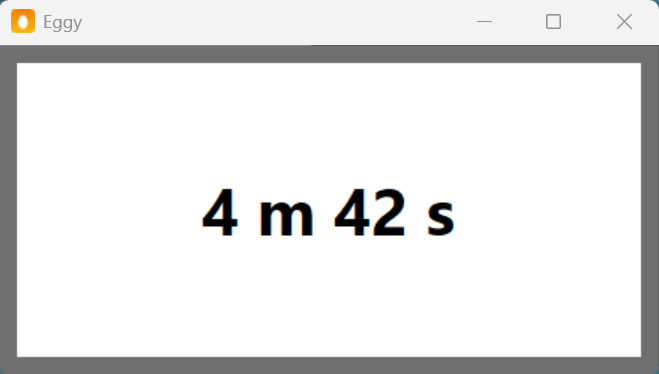

# Eggy

Eggy is a simple Windows countdown timer. Type how long to wait, press
**Enter**, and Eggy counts down in its window and plays `sounds/default.wav`
when the time is up.



## Requirements

- Windows
- Python 3.7 or later (tkinter and winsound are included with Python on
  Windows — nothing else to install)

## Running

```powershell
python eggy.py
```

Or double-click `eggy.py` if `.py` files are associated with Python.

## Using Eggy

1. Click in the window.
2. Type a duration (see below) and press **Enter**.
3. The window shows the remaining time, updating every second.
4. When the countdown reaches zero, `sounds/default.wav` plays.

Press **Esc** to quit.

## Entering a duration

A duration is one or more `Number Unit` pairs. Extra whitespace and
capitalization do not matter.

| To get seconds | To get minutes | To get hours |
| -------------- | -------------- | ------------ |
| `s`            | `m`            | `h`          |
| `sec`          | `min`          | `hr`         |
| `secs`         | `mins`         | `hrs`        |
| `second`       | `mn`           | `hour`       |
| `seconds`      | `mns`          | `hours`      |
|                | `minute`       |              |
|                | `minutes`      |              |

A number with no unit counts as seconds.

Examples:

| Input          | Counts down   | Display starts at |
| -------------- | ------------- | ----------------- |
| `10s`          | 10 seconds    | `10 s`            |
| `10 seconds`   | 10 seconds    | `10 s`            |
| `5m30s`        | 5 min 30 sec  | `5 m 30 s`        |
| `1 hour 12 m`  | 1 h 12 min    | `1 h 12 m 0 s`    |
| `  2 MIN `     | 2 minutes     | `2 m 0 s`         |
| `45`           | 45 seconds    | `45 s`            |

The display only shows the units you asked for: seconds only if you entered
seconds, minutes and seconds if you entered minutes, and hours, minutes, and
seconds if you entered hours. It ends at `0 s` (or `0 m 0 s`, or
`0 h 0 m 0 s`), then the sound plays.

While a countdown is running, type a new duration and press **Enter** to
restart with the new time.

## Settings

Eggy remembers the last duration you entered. It is saved to a per-user
settings file:

```
%APPDATA%\Eggy\settings.json
```

- On startup, the last duration is already filled in (selected, so typing
  replaces it).
- When a countdown finishes and the sound plays, the entry resets to that
  same duration — running another **5 m** timer is just pressing **Enter**
  again.

Delete the file to start fresh.

## Customizing

- **Sound**: replace `sounds/default.wav` with any `.wav` file of the same
  name. If the file is missing, Eggy falls back to the system beep.
- **Unit words**: edit the `UNIT_ALIASES` table near the top of `eggy.py` to
  accept additional spellings.
- **Icon**: replace `eggy.ico`

## Files

| File             | Purpose                                     |
| ---------------- | ------------------------------------------- |
| `eggy.py`        | The application (single file)               |
| `eggy.ico`       | Window/taskbar icon (white egg on orange)   |
| `sounds/default.wav` | Sound played when time is up            |
